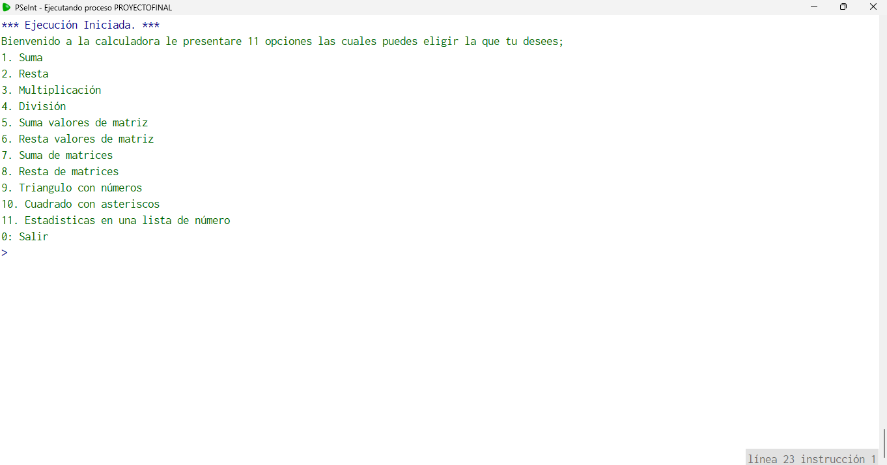

# proyectoFinalCalculator Calculadora Avanzada en PSeInt
# calculadora-pseint

## Descripción
Proyecto Final de ingenieria en sistemas de informacion 
Seccion: B
Calculadora en PSeInt con múltiples funciones: operaciones básicas, manejo de matrices, figuras y estadísticas.

## Funcionalidades

- Operaciones básicas: suma, resta, multiplicación, división.
- Suma y resta de todos los valores de una matriz.
- Suma y resta de matrices.
- Dibujos de triángulos con números y rectángulos con asteriscos.
- Estadísticas básicas: suma, promedio, mayor, menor y conteo respecto al promedio.

## Cómo usar

1. Abre el programa PSeInt.
2. Carga el archivo con el código fuente del proyecto está disponible aquí: [ProyectoFinalCalculator.psc](./ProyectoFinalCalculator.psc)
3. Ejecuta el programa.
4. Sigue las instrucciones que aparecen en pantalla para seleccionar las opciones y realizar cálculos.

## Manuales

Puedes descargar el manual técnico y de usuario completo aquí:  
[Manual Técnico y de Usuario](./ManualTecnicoYDeUsuario.pdf)

## Capturas

## Autor

Josué Emanuel David Reyes Yumán  
Carnet: 7690-25-10867

Alan Raúl Ramos Lucas CARNET: 7690-25-9925 

Fernanda Carolina Méndez López CARNET: 7690-25 9384
